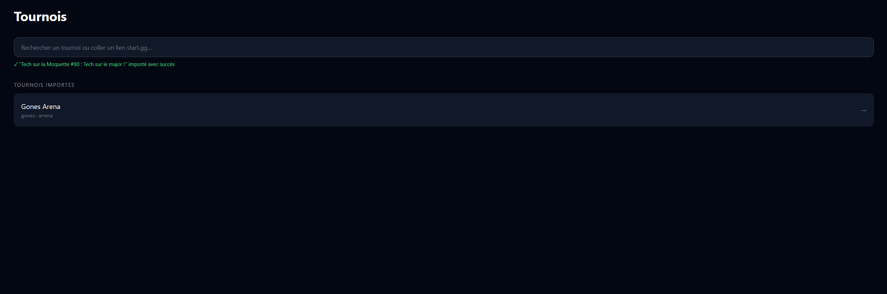
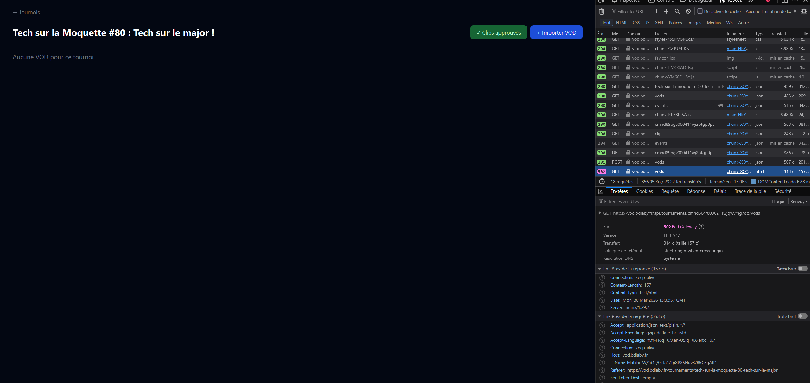

# VOD-Factory — Plan de Développement

## Contexte Projet

**VOD-Factory** est une plateforme d'indexation et de découpage automatisé de VODs e-sport, avec focus sur Super Smash Bros. Ultimate.

- **Stack** : Monorepo Nx, NestJS (back), Angular 21 (front), Prisma (PostgreSQL), BullMQ (Redis), FFmpeg, yt-dlp
- **Architecture** : Clean Architecture / Hexagonale
- **Cible** : usage interne pour TOs (Tournois Operators)

---

## Phase 1 — Socle Technique ✅

- [x] Nx 22.5.4, structure `/apps`, CI/CD GitHub Actions
- [x] NestJS + Clean Architecture (`domain/`, `application/`, `infrastructure/`)
- [x] DIP via tokens NestJS, Mappers Prisma ↔ Domaine
- [x] PostgreSQL via Docker, schéma `Tournament`, `Player`, `Set`, `Vod`

---

## Phase 2 — Intégration Start.gg ✅

- [x] `IStartGGService` + `StartGGService` (GraphQL via Axios)
- [x] `ImportTournamentUseCase` + `ImportSetsUseCase`
- [x] Filtres par jeux, ordonnancement par `startedAt`
- [x] `getStreamSetsByEventId` : pagination complète + filtre par `streamName`

⚠️ **Limitation connue** : `getSetsByEventId` paginé à 50 sets sans boucle (à corriger si event > 50 sets)

---

## Phase 3 — Video Management ✅

- [x] `YtDlpDownloadService` : téléchargement yt-dlp 1080p + merge AAC 192k
- [x] `AddVodToTournamentUseCase`, `GetTournamentVodsUseCase`
- [x] `VodController` : `POST /api/vods`, `GET /api/vods/:id`, streaming HTTP Range
- [x] Fix Windows : spawn direct ffmpeg pour extraction frames (`%05d` incompatible fluent-ffmpeg)

⚠️ **Limitation connue** : durée/résolution hardcodées (ffprobe non intégré)

---

## Phase 4 — Détection & Clipping Automatique ✅

### Détection HUD timer (remplacement OCR Tesseract)
- [x] Détection par % pixels blancs zone top-right (HUD timer SSBU)
- [x] State machine : `timerVisibleThreshold=3%`, `minGameDuration=90s`, `cooldown=25s`, `consecutiveAbsent≥3`
- [x] Validé sur 2 VODs : 9/9 games (2 BO5) + 3/3 games (3-0)

### Multi-set clipping + workers parallèles
- [x] `Clip` model Prisma + `ClipRepository` + `GET /api/vods/:id/clips`
- [x] `ClipSetProcessor` : WorkerHost BullMQ, concurrency 4, 1 job par set
- [x] `GenerateClipsFromTimestampsUseCase` : timestamps Start.gg → clips directs (sans détection)
- [x] Events JSON persistés sur `Vod` (évite re-analyse au clipping)
- [x] `-movflags +faststart` sur tous les clips générés (streaming navigateur immédiat)

---

## Phase 5 — Frontend Angular + Upload YouTube ✅

### Interface Angular 21
- [x] Page tournois : liste, import Start.gg, ajout VOD
- [x] Page VOD : lecteur vidéo, gestion téléchargement/analyse/clipping, nommage inline, remux faststart
- [x] Page clip-review : lecteur clip, recut dual-handle, approbation, édition titre/round/players/score
- [x] Thumbnail custom uploadable par clip
- [x] Page "Clips approuvés" par tournoi : liste avec statut upload YouTube
- [x] Navigation cohérente : retour tournoi depuis vod-detail, retour vod (section clips) depuis clip-review

### Upload YouTube
- [x] OAuth2 Google (flux installed app, redirect `localhost:3000/api/youtube/callback`)
- [x] `YouTubeService` : `getAuthUrl()`, `handleCallback()`, `uploadVideo()` + thumbnail auto
- [x] Upload en arrière-plan avec statut `UPLOADING → UPLOADED / FAILED` en base
- [x] `GOOGLE_CLIENT_ID` / `GOOGLE_CLIENT_SECRET` dans `.env`
- [x] Tokens OAuth sauvegardés localement (`storage/youtube-tokens.json`, ignoré git)

### Qualité / UX
- [x] Suppression fiable ancien clip + thumbnail après recut (`path.resolve()` sur Windows)
- [x] Suppression spam "Request aborted" dans les logs
- [x] Boutons "📍 → Début" / "📍 → Fin" dans vod-detail et clip-review
- [x] Prisma : `recordedAt`, `thumbnailPath`, `VOD.name` (migrations appliquées)

---

## Reste à faire (backlog)

- [x] Pagination Start.gg > 50 sets par event (déjà géré via `paginateEventSets()`)
- [x] `ffprobe` pour durée/résolution réelles — `FfprobeService` appelé après download et après upload fichier
- [x] Option suppression VOD source après génération clips — `DELETE /api/vods/:id/file` + bouton dans l'UI
- [x] BullMQ download — `VodDownloadProcessor` sur queue `vod-download`, remplace le fire-and-forget
- [x] Support VODs locales : import fichier depuis interface (copie vers `storage/vods/`)

---

## Stack Technique

| Couche | Technologie |
|--------|-------------|
| Monorepo | Nx 22.5.4 |
| Backend | NestJS 11, TypeScript 5.9 |
| Frontend | Angular 21, Tailwind CSS |
| Base de données | PostgreSQL 15, Prisma 5.22 |
| Queue / Jobs | Redis + BullMQ (concurrency 4) |
| Vidéo | FFmpeg, fluent-ffmpeg 2.x, yt-dlp |
| YouTube | googleapis (OAuth2 + YouTube Data API v3) |

---

## Historique

**18-19/03/2026** : Socle Nx/NestJS, Prisma, Start.gg GraphQL, pipeline OCR (puis abandon Tesseract → HUD timer)

**20/03/2026** : Multi-set clipping, BullMQ workers parallèles, Clip model, nettoyage git (6.7 GB purgés)

**23-24/03/2026** : Angular frontend complet, clip-review UI, streaming vidéo, YouTube OAuth upload, remux faststart, thumbnail custom, fix recut Windows

**24/03/2026** : Backlog terminé — ffprobe (durée/résolution réelles), BullMQ download queue, suppression fichier source VOD, import VOD local depuis UI

J'ai reussi a deployer le https et j'ai du modifier cette ligne dans le prisma.schema pcq c une archi arm jsp quoi
"  binaryTargets = ["native", "linux-musl-openssl-3.0.x", "linux-musl-arm64-openssl-3.0.x"]"
Il faudrait qu'on puisse supprimer les clips depuis l'interface de gestion des clips dans une vod ( par ex la j'ai 3 sets auto générés qui font 5 sec donc ils sont inexploitables mais je dois aller sur chaque sets un par un pr les delete)

Il faudrait que l'utilisateur n'ait pas a rentrer la commande pr le timestamp unix a la main
Quitte a lui demander l'url de la vod -> executer la requete depuis un bouton -> envoyer la data au back

Il faudrait etre plus explicite " page tournoi " = a quoi elle sert ? -> récuperer les informations ( sets / evenements / etc ) du tournoi dont on souhaite découper les vods
"page import vod" -> Dans l'onglet d'Import des vods, il faut expliquer pourquoi importer les vods et que dans le cas ou l'import se fait depuis les fichiers locaux, il faudra synchroniser l'heure ou le stream s'est deroulé avec les timings du tournoi 
Expliquer aussi que renseigner le nom de la vod et l'event permet de regrouper les vods en fonction de ces criteres 
eventuellement pouvoir supprimer les vods directement depuis cet ecran aussi  

J'ai des bad geteway par ci par la ( quand j'importe une vod que ce soit depuis l'url ou les fichiers locaux )
Le bug du slider est a fix aussi sur l'interface de gestion des clips la ou y'a la vod entiere

 y'a marqué tournoi ajouté mais j'dois refresh pour pouvoir cliquer sur le tournoi

 j'ai importé une vod par l'url mais j'dois refresh pr voir la vod et surtout je sais meme pas si elle se dl vraiment pcq y'a une 502 

Rajouter la possibilité de copier la meme description pour tout les clips d'une vod genre par ex a coté de la vod ou on peut faire des clips manuellement
Pouvoir créer des clips manuel avec un timer format hh:mm:sec ( pareil que pr les clips dans l'interface de clip specifique)
comme ça on peut rajouter de quoi améliorer le referenceemnt ( et rajouter SSBU Tournament dans la vod aide aussi)

Qu'est-ce qui se passe si on veut utiliser l'outil en plein live (ca peut etre interessant pr realiser des live tweet)

Ca me genere une playlist par dl pas une playlist par tournoi
Et faudrait p't'etre envisager un delete auto des vods et clips au bout de 48h sinon on sera full space
Ou en tt cas un moyen de limiter l'espace que peut prendre un utilisateur de la plateforme
ET du mettre en place l'auth et qu'un utilisateur puisse upload au choix ses vods sur la chaine yt qu'il veut auquel il se sera connecté
